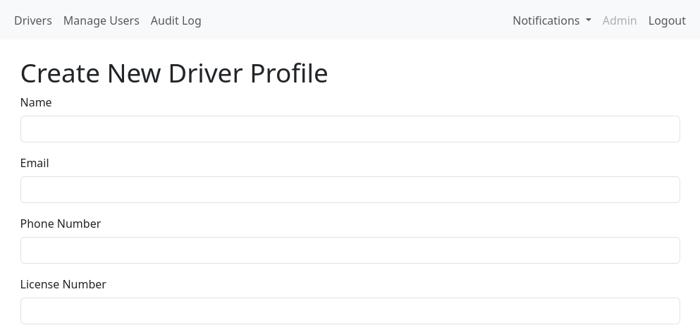
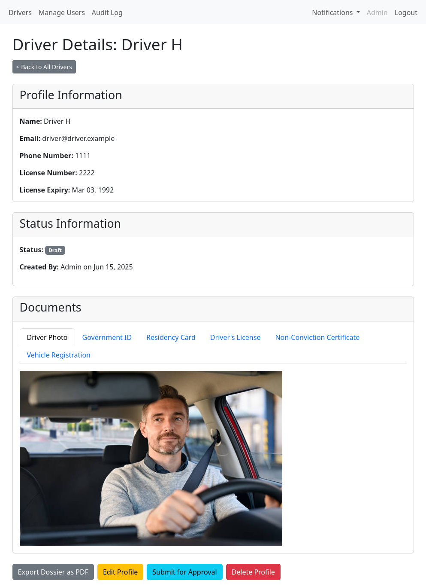
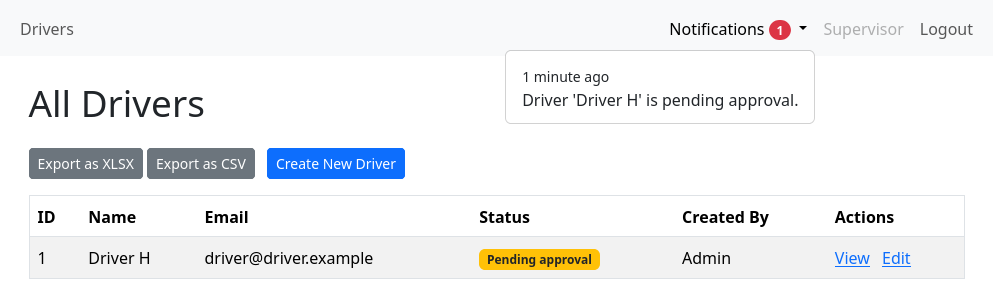
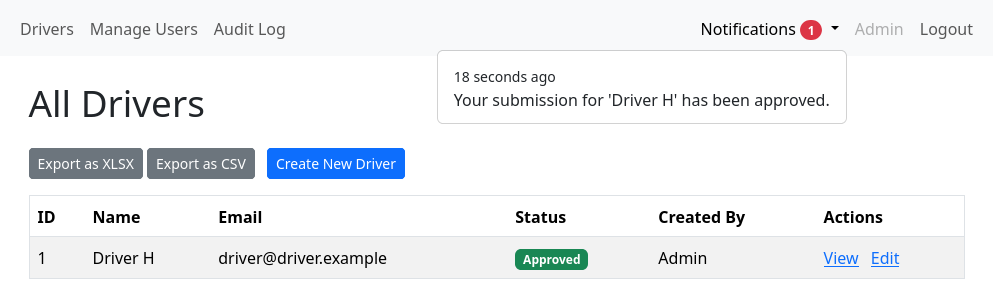
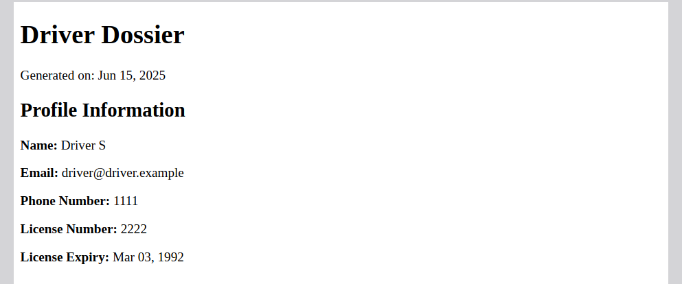
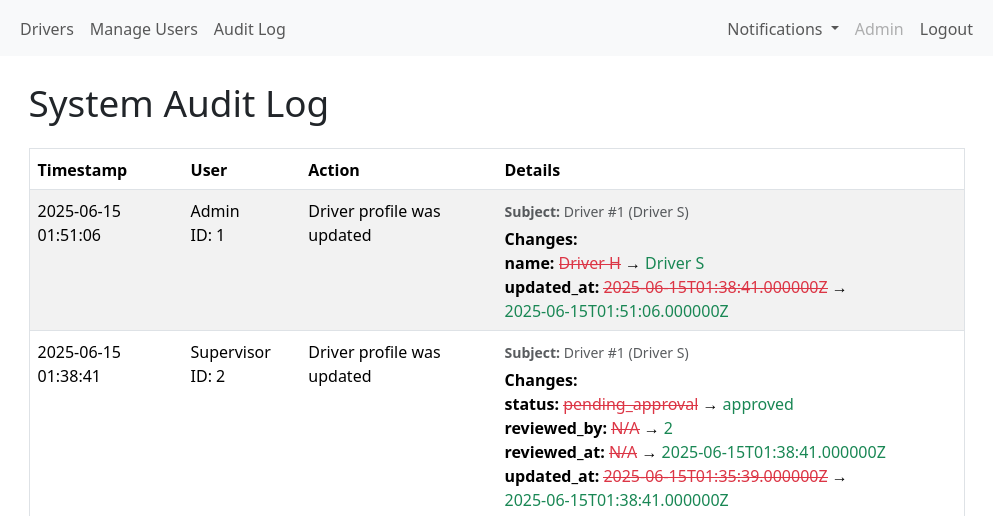
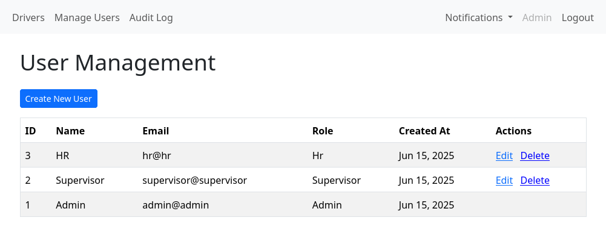

This is a simple but opinionated driver onboarding application with multi-user support, permissions, notifications, data exports (CSV/XLSX/PDF), among other things. It is especially focused on auditability: it features a comprehensive audit log, and if something gets in, it never gets out.

The code was written to be easily digestable, sometimes at the risk of going against "best practices" (denormalization, view/controller bloat, ...). It uses Laravel 12 (with Bootstrap 5 for styling). 

### Permission model

The app features 3 user roles: `admin`, `supervisor`, and `hr`.

- `hr`: Can CRUD drivers and submit drafts for approval.
- `supervisor`: Can do everything `hr` can, in addition to reviewing (approving/rejecting) driver drafts.
- `admin`: Can do everything `supervisor` can, in addition to managing non-admin user accounts and viewing the audit log.

### Workflow

Drivers are created as drafts by default, you don't have to fill in all of their data at once (but the data you enter will be validated). In fact, you could leave all fields empty and you would still get a driver.



Once everything has been filled in, you can click the `Submit for Approval` button, which notifies all supervisors (but not admins).



Notifications are smart: you don't have to click on them to dismiss them, all it takes is going to the driver's page (directly or indirectly). They also go away if a driver is deleted or has been reviewed by a different user.



The creator is notified once the driver is reviewed.



Rejected drivers can be resubmitted for approval. There's always hope.

You can generate a dossier for each individual driver as a PDF.



You can also get a bulk export CSV/XLSX, which looks like this:

```
"id","name","email","phone_number","license_number","license_expiry_date","photo_path","doc_gov_id_path","doc_residency_card_path","doc_drivers_license_path","doc_non_conviction_path","doc_vehicle_reg_path","status","rejection_reason","created_by","submitted_at","reviewed_by","reviewed_at","deleted_at","created_at","updated_at"
"1","Driver H","driver@driver.example","1111","2222","1992-03-03 00:00:00","Uploaded","Uploaded","Uploaded","Uploaded","Uploaded","Uploaded","Approved","","Admin","2025-06-15 01:35:39","Supervisor","2025-06-15 01:38:41","","2025-06-15 01:32:51","2025-06-15 01:38:41"
```

Here's what the audit log looks like:



And here's the user management portal:



### What's Missing

Given the small scale and scope of this project, many things were left out, including, but not limited to:

- Caching
- Ratelimiting
- Customization
- Testing
- Searching/Filtering
- Live updates
- Indexing
- In-depth validation
- Pruning

### Deployment on Heroku

You need to include the following buildpacks (in order):

- jontewks/puppeteer
- heroku/nodejs
- heroku/php

Set these environment variables:

```
DB_CONNECTION=mysql
FILESYSTEM_DISK=s3
PLATFORM=heroku
```

Then fill and set these:

```
APP_KEY (php artisan key:generate --show)
AWS_ACCESS_KEY_ID
AWS_BUCKET
AWS_REGION
AWS_SECRET_ACCESS_KEY
DB_USERNAME
DB_PASSWORD
DB_HOST
DB_PORT
DB_DATABASE
```

Then deploy, run the following commands and log in:

```
heroku run php artisan migrate -a heroku_app_name
heroku run php artisan app:create-admin-user -a heroku_app_name
```

If needed, you can also run:
```
heroku run php artisan app:delete-admin-user -a heroku_app_name
```
